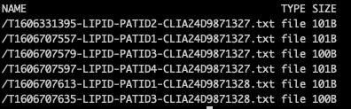
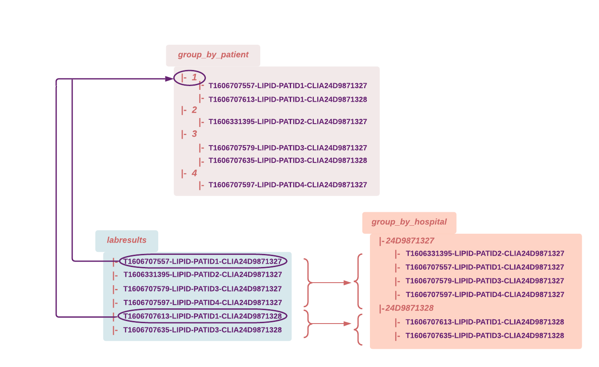

## Before You Start

You must have the completed the following to start this tutorial:

- [x] Pachyderm running [locally](https://docs.pachyderm.com/latest/getting-started/local-installation/).
- [x] [pachctl command-line ](https://docs.pachyderm.com/latest/getting-started/local-installation/#install-pachctl) installed, and your context created (i.e., you are logged in)

### Key Concepts

* [Group](https://docs.pachyderm.com/latest/concepts/pipeline-concepts/datum/group/) pipelines - execute your code on files that match a specific naming pattern in your group repo(s).
* [Glob patterns](https://docs.pachyderm.com/latest/concepts/pipeline-concepts/datum/glob-pattern/) - A "RegEx-like" string matching on file paths and names.

Additionally, make sure that you understand the concept of [datum](https://docs.pachyderm.com/latest/concepts/pipeline-concepts/datum/relationship-between-datums/). 


## Use Case: Healthcare  

Our first example comes from a simple healthcare use case:

> A patient gets test results, each lab result can come from a different lab/hospital. Each of our files contains the test results from a particular lab/hospital for a given patient.

### Data Structures

- **Input Repo**: `labresults`
- **Input Files**: **T**`{time}`-`{testType}`-**PATID**`{patientId}`-**CLIA**`{labId}`

```
    └── T1606707557-LIPID-PATID1-CLIA24D9871327.txt
    └── T1606331395-LIPID-PATID2-CLIA24D9871327.txt
    └── T1606707613-LIPID-PATID1-CLIA24D9871328.txt
    └──  ...
```


### Goals

We want to aggregate our labresults by patient or by hospital. We will create two separate use cases out of the same input repository.

Following the 2 steps pattern described in our [datum processing documentation](https://docs.pachyderm.com/latest/concepts/pipeline-concepts/datum/relationship-between-datums/), we will need 2 pipelines:

- One performs a group by patient ID or lab/hospital ID (depending on the use case) then outputs one text file per match. We designed the source code of the pipeline to sort those text files into directories named after the patient ID or the hospital ID.

    1. **Pipeline input repository**: `labresults`. 
        - For group by patient: We group by PATID. 
        - For group by hospital: We group by CLIA.

    2. **Pipeline**: Executes a set of command lines creating a new directory named after each capture group and copying the files that match the given group. (See our 2 pipelines:[`lab_group_by_hospital.json`](./pipelines/lab/lab_group_by_hospital.json) and [`lab_group_by_patient.json`](./pipelines/lab/lab_group_by_patient.json)).

    3. **Pipeline output repository**: `group_by_hospital`or `group_by_patient` depending on which use case you run.

        Each output repo will contain a list of sub-directories named after each capture group and populated with a copy of their matching files.

- A following pipeline will "glob" all files in each directory, then merge their content into a final text file.

    1. Pipeline input repositories: The `group_by_hospital`or `group_by_patient` output repo becomes the input repo of the following pipeline.

    1. Pipeline: The `reduce_group_by_hospital.json` or `reduce_group_by_patient.json` pipeline "globs" each directory ("glob": "/*") and merge the content of all their file into one txt file named after the directory name.

    1. Pipeline output repository: The output repo `reduce_group_by_hospital` or `reduce_group_by_patient` will contain text files listing all lab results per lab/hospital or per patient.

## Walkthrough

1. Prepare your data:
 
    Let's create our mock dataset and populate our initial input repository.
    The setup target `setup-lab` of the `Makefile` in `pachyderm/examples/group` will create a directory (labresults) containing our example data.
    In the `examples/group` directory, run:
    ```shell
    make setup-lab
    ```
    Optionally, you can run a `ls labresults/` to check what the data look like.
2. Before creating our first pipelines, let's preview what our datums will look like by running the following command in the `examples/group` directory:

    ```shell
    pachctl list datum -f pipelines/lab/lab_group_by_hospital.json 
    ```
    or
    ```shell
    pachctl list datum -f pipelines/lab/lab_group_by_patient.json 
    ```
    For example, in the case of a "group by patient", note that one datum is created for each patient ID. Each datum containing all the lab results for this patient:
        
    | PATIENT ID| FILES IN DATUM |
    |-----------|----------------|                                    
    |PATID1| /T1606707557-LIPID-PATID1-CLIA24D9871327.txt <br> /T1606707613-LIPID-PATID1-CLIA24D9871328.txt |
    |PATID2|/T1606331395-LIPID-PATID2-CLIA24D9871327.txt |
    |PATID3|/T1606707579-LIPID-PATID3-CLIA24D9871327.txt <br> /T1606707635-LIPID-PATID3-CLIA24D9871328.txt |
    |PATID4|/T1606707597-LIPID-PATID4-CLIA24D9871327.txt|

3. Populate Pachyderm's repository and create your pipelines:

    In the `examples/joins` directory, run:
    ```shell
    make deploy-lab
    ```
    then: 
    ```shell
    make create-lab
    ```
    or run:
    ```shell
    pachctl create repo labresults
    pachctl put file -r labresults@master:/ -f labresults

    pachctl create pipeline -f pipelines/lab/lab_group_by_hospital.json 
	pachctl create pipeline -f pipelines/lab/lab_group_by_patient.json
	pachctl create pipeline -f pipelines/lab/reduce_group_by_hospital.json 
	pachctl create pipeline -f pipelines/lab/reduce_group_by_patient.json
    ```
    Have a quick look at your input repository: 
    ```shell
    pachctl list file labresults@master
    ```
    You should see the following files:

    

    The commit in your entry repository has triggered the execution of your pipelines (i.e., a job). 
    ```shell
    pachctl list pipeline
    ```    

1. Check the output repository of the first pipeline in both use cases. Our code has created one txt file per datum. Each datum has been placed in a directory named after its capture group:

    ```shell
    pachctl list file group_by_hospital@master
    ```
    or
    ```shell
    pachctl list file group_by_patient@master
    ```
    For visual confirmation of their content, run:
    ```shell
    pachctl list file group_by_patient@master:/1/
    ```

1. Now check the output repo of the second pipeline:
    ```shell
    pachctl list file reduce_group_by_hospital@master
    ```
    and notice the 2 text files /24D9871327.txt and /24D9871328.txt, one for each lab/hospital ID.

    You can check their content by running:
    ```shell
    pachctl get file  reduce_group_by_hospital@master:/24D9871327.txt
    ```
    and notice the list of all labresults coming from this lab ID in this txt file.

    Repeat for `pachctl list file reduce_group_by_patient@master`.

In the diagram below, we have mapped out the data of our example and the expected results in each case.
    